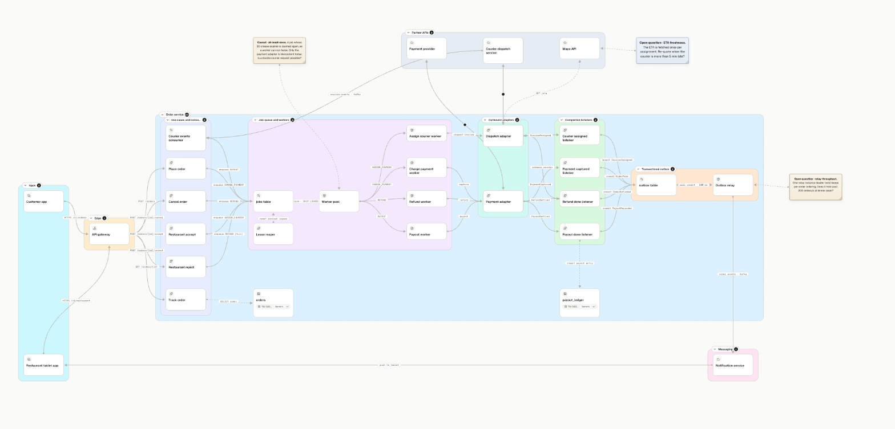
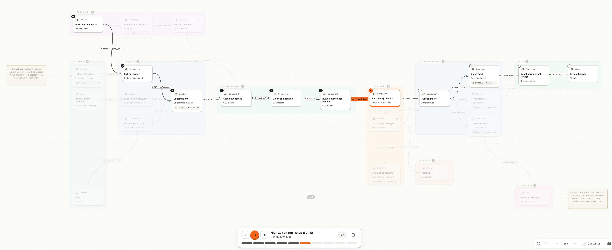
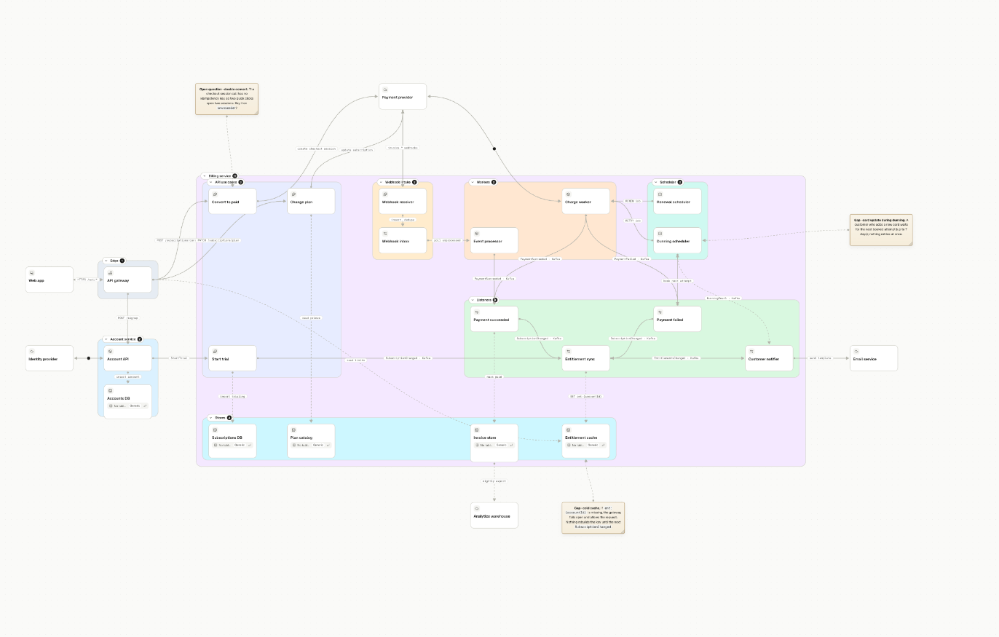
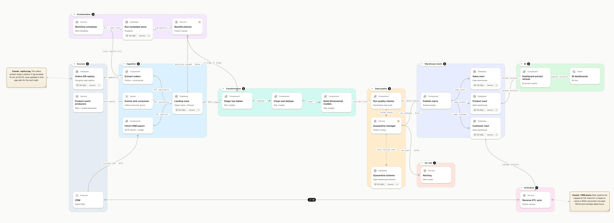

# Sododeck diagram skill

**Architecture diagrams you can press play on.** An AI agent skill that turns a description, or
your codebase, into a [Sododeck](https://sododeck.com) deck: cards, connectors, step-by-step
flows that light up across the picture, and decision tables on the steps that decide. Hand-laid,
checked offline, and ready to import.

Works with Claude Code, Codex and any agent that reads [Agent Skills](https://agentskills.io).

[](docs/screenshots/food-delivery.png)

---

## Why

Ask an AI for an architecture diagram and you usually get boxes and arrows that say nothing about
what actually happens: which service hands the work to which, what is decided where, what goes
wrong. This skill draws the **hand-offs**, so every flow is a path you can play, and checks the
result with the same code Sododeck uses to open it.

- **Flows you can play.** Each flow is one unbroken walk along connectors, from its real trigger
  to its real end. Press play in Sododeck and watch it travel.
- **Hand-laid, not auto-laid.** Cards sit on a column grid with data flowing left to right,
  grouped in coloured frames. A bundled linter rejects connectors that run over cards and frames
  that overlap.
- **Rules where decisions happen.** Status mappings, eligibility checks and policies become
  decision tables attached to the step that applies them.
- **Honest about code.** In codebase mode the agent traces every hop in the code, links each card
  and connector to its source lines, and pins anything that looks wrong as a "Gap" note.
- **Offline.** The scripts run on Node 20+, read only the files you name, and never send your
  deck anywhere.

[](docs/screenshots/flow-playing.png)

*A flow playing in Sododeck: each step lights the hand-off it walks; the rest of the deck dims.*

## What it makes

<table>
<tr>
  <td align="center" width="33%"><a href="docs/screenshots/food-delivery.png"></a><br><b>Food delivery</b><br><sub>Service internals, outbox, workers, refunds</sub></td>
  <td align="center" width="33%"><a href="docs/screenshots/saas-billing.png"></a><br><b>SaaS billing</b><br><sub>Webhooks, dunning rules, entitlements</sub></td>
  <td align="center" width="33%"><a href="docs/screenshots/data-pipeline.png"></a><br><b>Data pipeline</b><br><sub>Nightly ETL, quality gates, reverse sync</sub></td>
</tr>
</table>

Every example in [`examples/`](examples) was written by an agent with this skill, from a short
prompt. Each folder has the deck (`.sododeck`, open it in Sododeck) and the generator script the
agent wrote to lay it out.

---

## Install

**Claude Code** (plugin marketplace):

```text
/plugin marketplace add FamManh/sododeck-diagram-skill
/plugin install sododeck-diagram@sododeck
```

**Any Agent Skills host** (Claude Code, Codex, Cursor, …): copy or link the skill folder into
your skills directory.

```bash
git clone https://github.com/FamManh/sododeck-diagram-skill.git ~/code/sododeck-diagram-skill

# one shared copy, linked into each tool you use
mkdir -p ~/.agents/skills ~/.claude/skills
ln -s ~/code/sododeck-diagram-skill/skills/sododeck-diagram ~/.agents/skills/sododeck-diagram
ln -s ~/.agents/skills/sododeck-diagram ~/.claude/skills/sododeck-diagram
```

Update with `git pull` in the clone. The only requirement is **Node 20 or newer** for the check
scripts; there is nothing to install.

---

## Use

Just ask. The skill triggers on any request for a system, architecture, service or flow diagram,
or when you mention a `.sododeck` file.

```text
Make a deck of our checkout: web shop, API gateway, order service, payment provider,
Kafka and Postgres, and the checkout flow from pressing Pay to the confirmation email.
```

For a codebase, say what the deck is **about** and **which flows** you want to play. That list
is what the agent builds the picture around:

```text
Use the sododeck-diagram skill in codebase mode, detail faithful.
Draw <topic> from the code in <path>. Docs are leads only; where they disagree with the
code, add a Gap note.
Focus: <service or module>, shown in detail. Other systems: one card each.
Flows I want to play: <auto ..., manual ..., callback from partner ...>.
Write it with a generator script and save deck + script in <folder>.
```

Then open [Sododeck](https://app.sododeck.com), **Library → Import**, and drop the file. Play each
flow. If Sododeck reports a problem, press **Copy problems** and paste it back to the agent: the
report has the same codes and fix hints as the skill's own linter.

### Working in rounds

The best decks come from short rounds, each checked in the app:

1. **Skeleton**: the systems and the main flow.
2. **Open the service you care about**: "split the backend by use case, worker and listener".
3. **Add what is missing**: "also draw the callback when the partner attaches an invoice".

Ask the agent to change the generator script, not the JSON. Ids stay stable, so anything you
moved or saved in Sododeck stays attached, and `diff.mjs` shows exactly what changed.

### Dials

| Dial     | Values                                                                     |
| -------- | -------------------------------------------------------------------------- |
| Detail   | `faithful` (up to 60 cards on a screen), `balanced` (30), `simplified` (10) |
| Audience | `engineer` (protocols, payloads, source links), `mixed`, `executive`       |
| Mode     | `new`, `update`, `codebase`, `text` (Mermaid, C4, OpenAPI, whiteboard files and screenshots), database |

---

## What is inside

```
skills/sododeck-diagram/
  SKILL.md              the router the agent reads first
  references/           one guide per task: layout, modeling, flows, rules,
                        from-codebase, from-text-formats, from-diagrams, database, taste, scripts
  scripts/              validate · lint · deliver · diff · summary · outline (Node 20+, offline)
  schema/v1.json        the .sododeck file format
  examples/             small reference decks
```

The scripts are Sododeck's own model code, bundled into one file, so the skill and the app never
disagree about whether a deck is valid. `lint` adds the skill's layout and taste checks on top:
cards without a position, connectors over cards, frames covering another group's card, labels
over budget, missing source links in codebase mode.

```bash
node skills/sododeck-diagram/scripts/lint.mjs my.sododeck --format text --detail faithful
```

This repository is generated from the Sododeck monorepo; please open issues here, but don't edit
`skills/` by hand.
